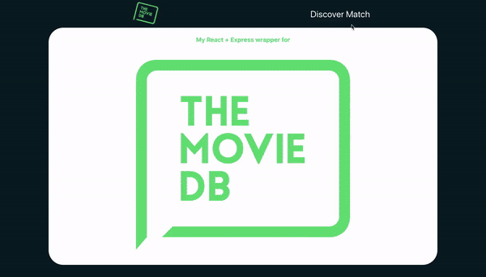

# The movie database

React + Express wrapper for [The Movie Database API](https://developers.themoviedb.org/3)

### Features:

- discovers if 2 people ever worked together on a movie. (See more [Discover Examples](https://www.themoviedb.org/documentation/api/discover?language=en-US))
- shows person's profile in a popup window
- shows movie's page in a redirected page

### Technologies:

The client side was bootstrapped with [Create React App](https://github.com/facebook/create-react-app).
The server side is created using Node/Express.js.

### Deployment:

Server runs on [http://localhost:5000](http://localhost:5000) from project directory:

### `npm start`

React runs on [http://localhost:3000](http://localhost:3000) from client directory:

### `npm start`
